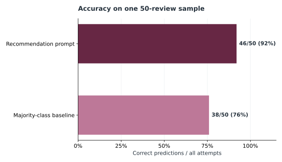

# Retail Feedback Intelligence

A reproducible portfolio project for analyzing apparel reviews and testing whether a language model can predict the reviewer's product recommendation. It turns the original exploratory notebook into a small Python package with bounded command line experiments, schema validation, offline tests, and a clean walkthrough notebook.

## Evaluation snapshot

The verified 50-review run produced 46 correct predictions (92%). On that same sample, always predicting its majority class would give 38/50 (76%). This small comparison illustrates the run; it is **not** a generalization estimate or a claim that the model will retain this advantage on other reviews. See the [evaluation gallery](docs/results.md#evaluation-gallery) for the confusion matrix and limitations.



## What it does

- Loads the [Women's E-Commerce Clothing Reviews dataset](https://www.kaggle.com/datasets/nicapotato/womens-ecommerce-clothing-reviews), including comma-separated source files and semicolon-separated notebook exports.
- Compares six original analysis prompt variants (zero-shot, few-shot, and stepwise prompts), recording valid structured responses. Schema validity alone does **not** establish answer quality.
- Evaluates a binary recommendation prompt against the dataset's `Recommended IND` label. Invalid responses abstain and count as failed attempts in `accuracy_all_attempts`; the confusion matrix includes valid predictions only.

## Setup

Python 3.10+ is required. Download the CSV from the Kaggle page above and place it under `data/` (which is ignored by Git). The dataset is **not distributed here**; check its source terms before using or redistributing it. No API key is needed for the offline inspection or tests.

```bash
python -m venv .venv
source .venv/bin/activate
python -m pip install -e .
retail-feedback summary data/Womens\ Clothing\ E-Commerce\ Reviews.csv
python -m unittest discover -s tests -v
```

For a small, explicit live experiment, set `OPENAI_API_KEY` in your shell and choose an available chat model that supports JSON response formatting. The default sample is five reviews; each analysis variant makes one request per review. API calls may incur charges. Keep keys out of source files and outputs.

```bash
export OPENAI_API_KEY="your-key"
retail-feedback recommend data/Womens\ Clothing\ E-Commerce\ Reviews.csv --model YOUR_MODEL_ID --limit 5 --output results/recommendations.json
retail-feedback compare data/Womens\ Clothing\ E-Commerce\ Reviews.csv --model YOUR_MODEL_ID --limit 5 --variants zero_v1 zero_v2 few_v1 few_v2 cot_v1 cot_v2 --output results/comparison.json
```

The source file may have a different downloaded name; pass its actual path. Sampling uses pandas with seed 42 by default (`--seed` changes it). `data/`, `results/`, `.env`, and notebook outputs are excluded from version control.

To rebuild the two aggregate SVG figures from a locally generated recommendation report, install the optional plotting dependency and run:

```bash
python -m pip install -e '.[plots]'
python scripts/build_gallery.py results/recommendations.json
```

The script checks the summary against the report's row-level predictions. It writes only aggregate figures to `assets/`; review them before committing. The local JSON report and source reviews remain ignored.

If the API returns `credit_balance_exhausted`, the account or organization behind your key has no API credits. Check [API billing](https://platform.openai.com/settings/organization/billing/) and add credits before retrying. A ChatGPT subscription does not include API usage. This is a billing failure, not an invalid prediction; the evaluator stops without saving a report.

## Results and limits

The [results note](docs/results.md) separates the historical notebook observations from a new 50-review run supplied by the project owner. Both report 92% recommendation accuracy on the seeded sample. This is an exploratory result, not an out-of-sample validation or a claim about production accuracy. The six analysis prompt variants have not been rerun with this package.

The six prompts are adapted from the original notebook. They contain the fictional retail brand names and wording used in that experiment; minor inconsistencies in the original prompts are preserved so the variants remain recognizable. The new code uses the official OpenAI SDK endpoint by default and does not depend on a course-specific proxy or Google Drive mount.

## Repository map

| Path | Purpose |
| --- | --- |
| `src/retail_feedback/` | Data loading, original prompts, validation, evaluation, CLI |
| `notebooks/walkthrough.ipynb` | Clean offline walkthrough with a guarded optional API example |
| `tests/` | Synthetic fixture and offline workflow tests |
| `docs/results.md` | Historical findings, limitations, and reproducibility notes |
| `scripts/build_gallery.py` | Rebuild the two evaluation figures from a local JSON report |
| `assets/*.svg` | Aggregate figures shown in the README and results page |

## Responsible use

Customer replies and retail insights are generated drafts; review them before sending or acting. The dataset contains customer-written text, so avoid publishing raw reviews or API responses without checking the dataset's terms and privacy implications. The CSV and generated reports stay local by default.

Code license: [MIT](LICENSE). The dataset and model services have separate terms.
