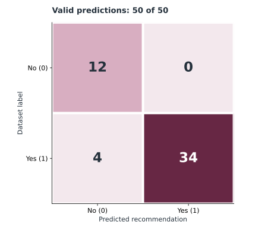

# Experiment results and interpretation

## Recommendation rerun supplied September 30, 2026

The project owner supplied `smoke-test.json` and `recommendations.json` generated with the package CLI and `gpt-4o-mini`. We checked their row-level predictions against the supplied Women's E-Commerce Clothing Reviews CSV (SHA-256 `bd93cc515747ad1f87b8bc863c9e40da758509e6db6506a96d06976e61e36ee0`). The loader retained 22,641 reviews with text; the 50 source-row indices and labels match pandas sampling with seed 42. The five-review smoke test matches the first five rows of the 50-review run.

### Evaluation gallery

The figures below were regenerated from the supplied 50-review JSON report by [`scripts/build_gallery.py`](../scripts/build_gallery.py). They contain aggregate counts only; the source CSV and row-level report are excluded from the repository. The historical prompt scores below are a separate notebook observation and are not plotted as part of this rerun.

The majority-class baseline always predicts the more common label in these same 50 reviews ("recommended"). Its 76% is a descriptive reference calculated on this sample, not a trained or independently evaluated baseline. The 16 percentage-point gap is specific to these 50 attempts.

Rows are dataset labels; columns are predictions. The four disagreements are reviews labeled “recommended” that the prompt classified “not recommended.” All 50 responses were valid in this run, so the displayed matrix covers every attempt.

| Measure | Five-review smoke test | 50-review run |
| --- | ---: | ---: |
| Valid predictions / attempted | 5 / 5 | 50 / 50 |
| Correct / attempted | 4 / 5 | 46 / 50 |
| Accuracy across all attempts | 80% | **92%** |

The 50-review run's confusion matrix, recomputed from the reported row-level predictions, is:

| Actual / predicted | 0 | 1 |
| --- | ---: | ---: |
| 0 | 12 | 0 |
| 1 | 4 | 34 |

The sampled labels contain 38 recommendations and 12 non-recommendations. Predicting the majority class for every sampled row would yield 38/50 = 76% accuracy; the reported run exceeds that by 16 percentage points on this sample. All four disagreements are false negatives relative to the dataset label. Review wording suggests some labels are ambiguous: one row labeled recommended has a low rating and explicitly describes returning the item; other labeled-recommended rows also discuss returns or quality concerns. A human label review would help distinguish model mistakes from label ambiguity.

The supplied JSON records predictions, labels, model alias, and seed, but no raw model responses, model snapshot, request IDs, or execution timestamp. We verified the metrics and dataset alignment, not the underlying API transaction. The result is a small in-sample reproduction, not a prospective performance estimate. The six analysis prompt variants and their LLM-judge scores were **not rerun**.

## Historical notebook observations

The original capstone loaded 23,486 rows and dropped 845 rows with missing review text, leaving 22,641. It sampled 50 reviews with pandas `random_state=42`. These are **recorded notebook outputs**, not results from a fresh run of this package.

| Analysis prompt | Notebook's average LLM-judge score |
| --- | ---: |
| Zero-shot v1 | 0.910 |
| Zero-shot v2 | 0.925 |
| Few-shot v1 | 0.927 |
| Few-shot v2 | 0.877 |
| Stepwise v1 | 0.938 |
| Stepwise v2 | 0.907 |

The notebook also recorded a separate comparative LLM judge favoring zero-shot v2 on 36 of 50 reviews, stepwise v2 on 10, and few-shot v2 on 4. Those comparisons used different scoring and should not be conflated with the averages above. LLM judgments are subjective and not independent human labels.

For recommendation prediction, the notebook reported **46/50 = 92%** on that sample. Its recorded confusion matrix was:

| Actual / predicted | 0 | 1 |
| --- | ---: | ---: |
| 0 | 12 | 0 |
| 1 | 4 | 34 |

The original parser mapped unparseable responses to zero, so this reported accuracy cannot establish how many valid responses were produced. The new evaluator records invalid responses as abstentions and counts them as failures in accuracy across all attempts. The fresh run happens to reproduce the same aggregate matrix, but its JSON response-format setting and model alias may differ from the original API execution.

## How to reproduce another measurement

1. Obtain the source CSV from [Kaggle](https://www.kaggle.com/datasets/nicapotato/womens-ecommerce-clothing-reviews); record its version and checksum locally.
2. Install the package, set `OPENAI_API_KEY`, and run `retail-feedback recommend` with an explicit model, `--limit 50`, and `--seed 42`.
3. Save the JSON report under ignored `results/`. Record model ID, date, package version, seed, dataset version, valid count, both accuracy denominators, and confusion matrix.
4. For a broader estimate, evaluate an independently selected holdout set, check class balance, and assess errors by subgroup. Prompt comparison reports schema validity only; use independent labels or human reviewers to assess generated content quality.

API behavior and dataset revisions can change. No confidence interval, business uplift, or generalization claim follows from the 50-review notebook sample.
